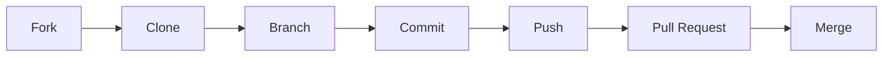

# CONTRIBUTING

# Contributing to SkoreFlow

Thank you by willing to contribute to **SkoreFlow**! 🚀
This guide provides a complete Git workflow using **fork + pull request**.

There is a lot of stuff, and ou can contriubute to 

```bash
.
├── backend/
├── frontend/
├── testauto/
├── wiki/

```

---

## 🍴 1. Fork the repository

```bash
git clone https://github.com/ckl67/SkoreFlow.git
cd SkoreFlow
```

Add upstream:

```bash
git remote add upstream https://github.com/ckl67/SkoreFlow.git
git remote -v
```

---

## 🌿 2. Create a branch

```bash
git checkout -b <github-login>/dev
```

Examples:

```bash
git checkout -b christian/dev
git checkout -b loic/fix/login-error
```

---

## 🔄 3. Workflow



---

## 💻 4. Development

```bash
git status
git add .
git commit -m "feat: add PDF export"
```

---

## 🔁 5. Sync with upstream

```bash
git fetch upstream
git checkout main
git merge upstream/main
```

Rebase:

```bash
git checkout <github-login>/feature/feature-name
git rebase main
```

---

## 🚀 6. Push

```bash
git push origin <github-login>/feature/feature-name
```

---

## 🔀 7. Pull Request

- Open PR on GitHub
- Explain what, why, how

---

## 🧪 8. Testing

See directory : /autotest

```bash
./auto-test.sh
```

All tests must pass.

---

## ✅ Checklist

- [ ] Builds
- [ ] Tests pass
- [ ] Up to date
- [ ] Clean commits
- [ ] PR documented
