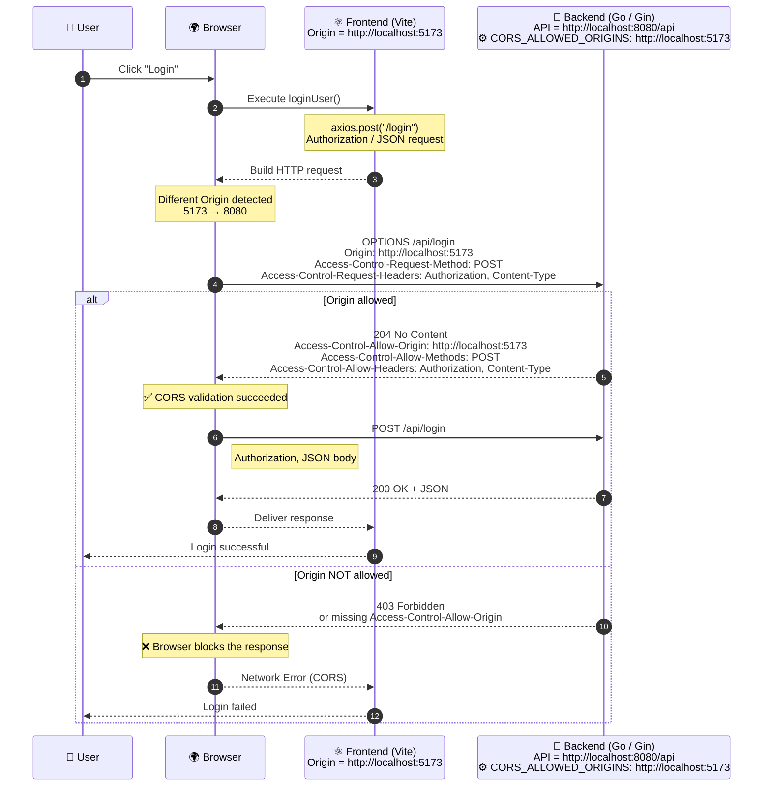
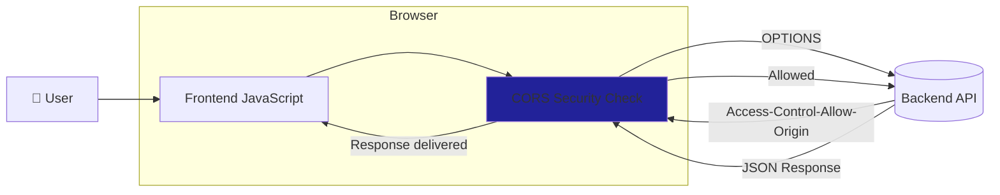

# 🌐 CORS Configuration Guide - SkoreFlow Backend

[← back](../doc.md)

## What is CORS?

CORS (Cross-Origin Resource Sharing) is a browser security mechanism.

By default, browsers enforce the Same-Origin Policy (SOP), which prevents a web application running on one origin from accessing resources from another origin unless the server explicitly allows it.

Example:

```shell
Frontend: http://localhost:5173
Backend: http://localhost:8080
```

Even though both run on your machine, they are considered different origins because the ports are different.
Without CORS configuration, the browser blocks the response.

## Important: CORS Is Enforced by the Browser

A common misconception is that the backend blocks the request.

In reality:

- The frontend sends a request.
- The backend responds.
- The browser checks whether the response contains the required CORS headers.
- If not, the browser hides the response from JavaScript.

This is why tools such as Postman, cURL, or backend-to-backend requests work even when CORS is misconfigured: they do not enforce browser security policies.

## How the Browser and Backend Communicate

Think of the browser as a security guard.

Before allowing a frontend application to access a backend hosted on another origin, the browser asks:

- "Does this server allow requests from this origin?"
- The backend answers through HTTP headers such as:
- Access-Control-Allow-Origin: `http://localhost:5173`
- If the origin is allowed, the browser lets the response reach the frontend code.

## Preflight Requests (OPTIONS)

For simple requests, the browser directly sends the request.

For more complex requests (for example using:

- Authorization
- Content-Type: application/json
- custom headers

), the browser first performs a Preflight Request.

### Step 1: OPTIONS Request

```http
OPTIONS /api/login
```

The browser asks:

"Are you okay with me sending this request?"

### Step 2: Server Response

```http
HTTP/1.1 204 No Content
Access-Control-Allow-Origin: http://localhost:5173
Access-Control-Allow-Methods: GET, POST, PUT, DELETE
Access-Control-Allow-Headers: Authorization, Content-Type
```

### Step 3: Actual Request

If the response is valid, the browser sends the real request:

```http
POST /api/login
```

## CORS Configuration in SkoreFlow

CORS is implemented through a Gin middleware.

The middleware must be registered during router initialization so that every request passes through it.

```go
r := gin.New()

r.Use(corsMiddleware)
```

If the middleware is attached too late in the request lifecycle, some requests may bypass it.

## Allowed Origins

Allowed origins are configured through the environment variable:

```go
//Local development
CORS_ALLOWED_ORIGINS=http://localhost:5173
```

```go
//Production
CORS_ALLOWED_ORIGINS=https://app.skoreflow.com
```

The value must exactly match the frontend origin.

Common mistakes:

- http vs https
- wrong port
- trailing slash (/)
- typo in the domain name

## Schematic

```txt
          Windows (192.168.1.141)
        ┌──────────────────────────────┐
        │          VSCode              │
        │          Firefox             │
        └──────────────┬───────────────┘
                       │ SSH
                       ▼
        Ubuntu VM (192.168.1.138)
        ┌──────────────────────────────┐
        │ backend Go :8080             │
        │ Vite dev server :5173        │
        └──────────────────────────────┘
```

- The backend is running on the VM ✅
- The Vite server is also running on the VM ✅
- Firefox is on Windows ✅

So when Firefox opens: `http://192.168.1.138:5173` that’s perfectly normal It’s Vite.

- Local development on the VM
  - Frontend: `http://localhost:5173`
  - API: `http://localhost:8080`

- Development on Windows using VSCode Remote
  - Frontend: `http://192.168.1.138:5173`
  - API: `http://192.168.1.138:8080`

- Access from another computer on the network
  - Frontend: `http://192.168.1.138:5173`
  - API: `http://192.168.1.138:8080`



## Overview



## A Real Issue Encountered

Observed Behavior

The preflight request worked correctly:

```http
OPTIONS /api/login
→ 204 No Content
```

The response contained all required CORS headers.

However, the actual request returned:

```http
POST /api/login
→ 200 OK
```

without:

```http
Access-Control-Allow-Origin
```

Firefox therefore blocked the response and displayed:

```http
CORS Error:
Access-Control-Allow-Origin header missing
```

## Root Cause

The CORS middleware was registered too late.

As a result:

- OPTIONS requests passed through the middleware.
- Regular requests (POST, PUT, DELETE, etc.) did not.

## Solution

Move the middleware registration directly into SetupRouter():

```go
func SetupRouter() \*gin.Engine {
r := gin.New()

    r.Use(corsMiddleware)

    return r

}
```

## A Cache Issue Encountered

### Avatar Cache Handling

The `/api/me/avatar` endpoint returns the avatar of the currently authenticated user.
Since the response depends on the JWT token, the resource must not be cached and reused between different users.

A browser cache issue was observed where switching users could display the previous user's avatar because the URL remained identical (`/api/me/avatar`).

The endpoint now sends appropriate HTTP cache headers:

- `Cache-Control: private, no-store`
- `Vary: Authorization`

This ensures that browsers do not reuse a cached avatar response for another authenticated user.

During development, clearing the browser cache may be required after changing cache policies, as existing cached entries can persist.

## Proxy Vite tackle the problem differently?

The **Proxy Vite** technique is a ‘workaround’ to completely bypass this CORS protocol during development:

1. Your React app calls `/api/users` (i.e. on `http://localhost:5173/api/users`).
2. The browser sees that the request stays within the **same domain** (`localhost:5173`). As far as it’s concerned, there’s no change of origin, so **it doesn’t even trigger CORS security**.
3. Behind the scenes, the Vite server (which is a development tool) intercepts the request and forwards it directly to your Linux VM (`192.168.X.X:8080`). Servers do not have CORS security between them; only browsers do.

### If you’d prefer not to use the Vite proxy (and keep the CORS logic pure)

Simply modify your React code so that it explicitly calls the VM:

```typescript
// Replace localhost with backend Linux IP address
fetch('http://192.168.X.X:8080/api/users');
```
