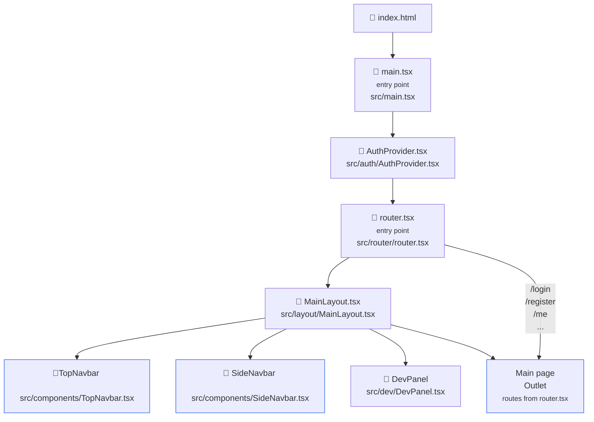

# Frontend Architecture flow

## Entry points Flow

Gives just a short overview of the entry points.
See also that **AuthProvider.tsx** is the central authentication component !



## Architecture

````mermaid
graph TD

%% UI LAYER
UI["UI Layer"]
PAGES["Pages"]
COMP["Components"]
LAYOUT["Layout"]

%% ROUTING
ROUTER["Router Layer"]
ROUTER_FILE["router.tsx"]

%% STATE
STATE["State Layer"]
AUTH["AuthProvider"]
USEAUTH["useAuth"]

%% SERVICES
SERVICES["Services Layer"]
AUTH_SVC["authService"]
USER_SVC["userService"]

%% API
API["api/client.ts"]
BACKEND["Backend API"]

%% FLOW
UI --> PAGES
UI --> COMP
UI --> LAYOUT

ROUTER --> ROUTER_FILE
PAGES --> ROUTER

STATE --> AUTH
STATE --> USEAUTH

PAGES --> SERVICES
SERVICES --> API
API --> BACKEND

STATE --> UI
```
````
