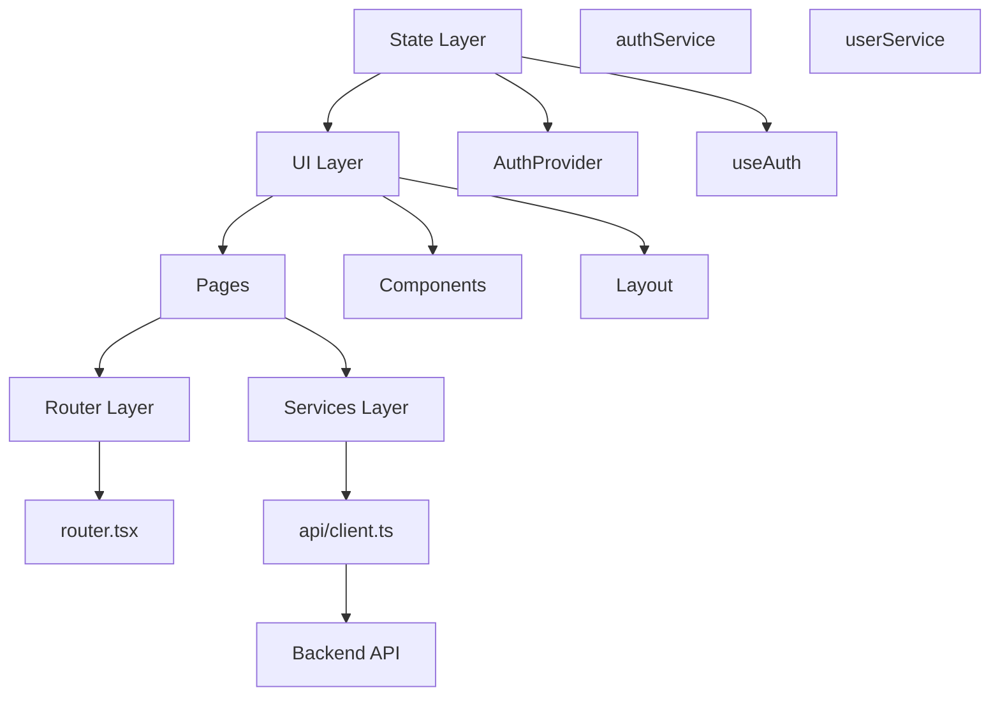

# Frontend Architecture flow

[← back](../doc.md)

## Entry points Flow

Gives just a short overview of the entry points.
See also that **AuthProvider.tsx** is the central authentication component !

```mermaid
graph TD

%% ClassDef
classDef file fill:#990000,stroke:#6b7280;
classDef component fill:#111122,stroke:#2563eb;
classDef main fill:#00005F

%% html entry : point
INDEX["📄 index.html"]

%% react entry point : main.tsx
MAIN["`📄 main.tsx
*entry point*
src/main.tsx`"]

AUTH["`📄 AuthProvider.tsx
src/auth/AuthProvider.tsx`"]

ROUTER["`📄 router.tsx
*entry point*
src/router/router.tsx`"]

INDEX --> MAIN
MAIN --> AUTH
AUTH --> ROUTER

%% First element in router : MainLayout
%% <br> NOT supported here
%% CR is OK !
MAINLAYOUT["`📄 MainLayout.tsx
src/layout/MainLayout.tsx`"]

ROUTER --> MAINLAYOUT

%% In MainLayout
TOPNAVBAR["`📄TopNavbar
src/components/TopNavbar.tsx`"]

SIDENAVBAR["`📄 SideNavbar src/components/SideNavbar.tsx`"]

%% Then rest of the route to OUTLET
OUTLET["`Main page
Outlet
routes from router.tsx`"]

%% DevPanel
DEVPANEL["`📄 DevPanel
 src/dev/DevPanel.tsx`"]

MAINLAYOUT --> TOPNAVBAR
MAINLAYOUT --> SIDENAVBAR
MAINLAYOUT --> DEVPANEL
MAINLAYOUT --> OUTLET

%% <br/> NOT supported here
ROUTER --> |/login
/register
/me
...| OUTLET


%% Class application

class TOPNAVBAR,SIDENAVBAR,OUTLET component;
class DEVPANEL file;
class MAINLAYOUT main;
```

## Architecture

