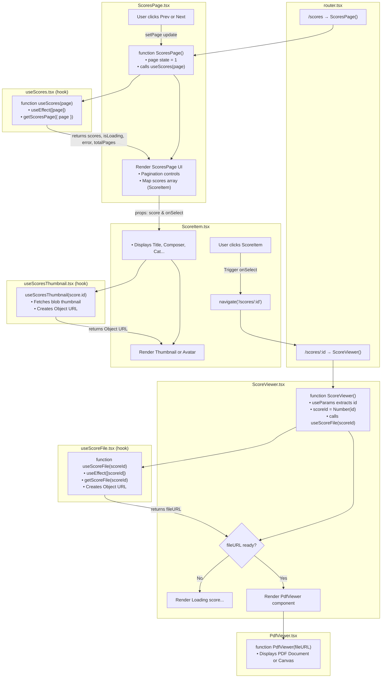

<!-- cspell:ignore autonumber  -->

# React Architecture: Component & Module Dependencies

## Score Module

```mermaid

graph TD
    %% 1. ROUTER
    subgraph FileRouter["router.tsx"]
        RouteScores["/scores → ScoresPage()"]
        RouteScoreViewer["/scores/:id → ScoreViewer()"]
    end

    %% 2. SCORES PAGE
    subgraph FileScoresPage["ScoresPage.tsx"]
        RouteScores --> FunctionScoresPage["function ScoresPage()<br/>• page state = 1<br/>• calls useScores(page)"]
        FunctionScoresPage --> DisplayScoresPage["Render ScoresPage UI<br/>• Pagination controls<br/>• Map scores array (ScoreItem)"]

        ClickPrevNext["User clicks Prev or Next"] -->|setPage update| FunctionScoresPage
    end

    %% 3. HOOK: useScores
    subgraph FileUseScores["useScores.tsx (hook)"]
        FunctionScoresPage --> FunctionUseScores["function useScores(page)<br/>• useEffect([page])<br/>• getScoresPage({ page })"]
        FunctionUseScores -->|returns scores, isLoading, error, totalPages| DisplayScoresPage
    end

    %% 4. SCORE ITEM
    subgraph FileScoreItem["ScoreItem.tsx"]
        DisplayScoresPage -->|props: score & onSelect| RenderItem["<ScoreItem /><br/>• Displays Title, Composer, Cat..."]
        RenderItem --> RenderThumbnail["Render Thumbnail or Avatar"]

        UserClickItem["User clicks ScoreItem"] -->|Trigger onSelect| NavigateViewer["navigate('/scores/:id')"]
        NavigateViewer --> RouteScoreViewer
    end

    %% 5. HOOK: useScoresThumbnail
    subgraph FileUseScoresThumbnail["useScoresThumbnail.tsx (hook)"]
        RenderItem --> HookThumbnail["useScoresThumbnail(score.id)<br/>• Fetches blob thumbnail<br/>• Creates Object URL"]
        HookThumbnail -->|returns Object URL| RenderThumbnail
    end

    %% 6. SCORE VIEWER
    subgraph FileScoreViewer["ScoreViewer.tsx"]
        RouteScoreViewer --> FunctionScoreViewer["function ScoreViewer()<br/>• useParams extracts id<br/>• scoreId = Number(id)<br/>• calls useScoreFile(scoreId)"]

        ConditionalRender{"fileURL ready?"}
        LoadingUI["Render Loading score..."]
        PdfUI["Render PdfViewer component"]

        FunctionScoreViewer --> ConditionalRender
        ConditionalRender -->|No| LoadingUI
        ConditionalRender -->|Yes| PdfUI
    end

    %% 7. HOOK: useScoreFile
    subgraph FileUseScoreFile["useScoreFile.tsx (hook)"]
        FunctionScoreViewer --> FunctionUseScoreFile["function useScoreFile(scoreId)<br/>• useEffect([scoreId])<br/>• getScoreFile(scoreId)<br/>• Creates Object URL"]
        FunctionUseScoreFile -->|returns fileURL| ConditionalRender
    end

    %% 8. PDF VIEWER
    subgraph FilePdfViewer["PdfViewer.tsx"]
        PdfUI --> RenderPdfComponent["function PdfViewer(fileURL)<br/>• Displays PDF Document or Canvas"]
    end


```
