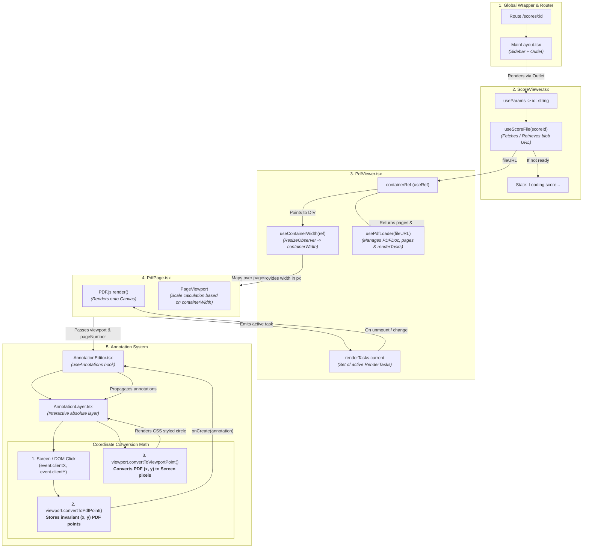

# React Architecture: Component & Module Dependencies

## Score Module

```mermaid
graph TD

    %% BASE APP AND LAYOUT
    subgraph APP ["1. Global Wrapper & Router"]
    MainLayout["MainLayout.tsx<br/><i>(Sidebar + Outlet)</i>"]
    Route["Route /scores/:id"]
    end

    %% MAIN SCORE VIEW
    subgraph SCORE_VIEWER ["2. ScoreViewer.tsx"]
        URLParam["useParams -> id: string"]
        useScoreFile["useScoreFile(scoreId)<br/><i>(Fetches / Retrieves blob URL)</i>"]
        Loading["State: Loading score..."]
    end

    %% PDF CONTAINER & MEASUREMENTS
    subgraph PDF_VIEWER ["3. PdfViewer.tsx"]
        ContainerRef["containerRef (useRef)"]
        useContainerWidth["useContainerWidth(ref)<br/><i>(ResizeObserver -> containerWidth)</i>"]
        usePdfLoader["usePdfLoader(fileURL)<br/><i>(Manages PDFDoc, pages & renderTasks)</i>"]
        RenderTaskSet["renderTasks.current<br/><i>(Set of active RenderTasks)</i>"]
    end

    %% PAGE COMPONENT & CANVAS
    subgraph PDF_PAGE ["4. PdfPage.tsx"]
        PdfJsRender["PDF.js render()<br/><i>(Renders onto Canvas)</i>"]
        ViewportCalculation["PageViewport<br/><i>(Scale calculation based on containerWidth)</i>"]
    end

    %% ANNOTATION SYSTEM
    subgraph ANNOTATION_SYSTEM ["5. Annotation System"]
        AnnotationEditor["AnnotationEditor.tsx<br/><i>(useAnnotations hook)</i>"]
        AnnotationLayer["AnnotationLayer.tsx<br/><i>(Interactive absolute layer)</i>"]

        subgraph MATHS ["Coordinate Conversion Math"]
            ClickEvent["1. Screen / DOM Click<br/>(event.clientX, event.clientY)"]
            ToPDFPoint["2. viewport.convertToPdfPoint()<br/><b>Stores invariant (x, y) PDF points</b>"]
            ToViewportPoint["3. viewport.convertToViewportPoint()<br/><b>Converts PDF (x, y) to Screen pixels</b>"]
        end
    end

    %% FLOW & CONNECTIONS
    Route --> MainLayout
    MainLayout -->|Renders via Outlet| URLParam
    URLParam --> useScoreFile
    useScoreFile -->|If not ready| Loading
    useScoreFile -->|fileURL| ContainerRef

    ContainerRef -->|Points to DIV| useContainerWidth
    ContainerRef --> usePdfLoader

    usePdfLoader -->|Returns pages & renderTasks| PDF_VIEWER
    useContainerWidth -->|Provides width in px| PDF_PAGE

    PDF_VIEWER -->|Maps over pages| PDF_PAGE
    PDF_PAGE -->|Emits active task| RenderTaskSet
    RenderTaskSet -->|On unmount / change| PdfJsRender

    PDF_PAGE -->|Passes viewport & pageNumber| AnnotationEditor
    AnnotationEditor --> AnnotationLayer

    AnnotationLayer --> ClickEvent
    ClickEvent --> ToPDFPoint
    ToPDFPoint -->|"onCreate(annotation)"| AnnotationEditor
    AnnotationEditor -->|Propagates annotations| AnnotationLayer
    AnnotationLayer --> ToViewportPoint
    ToViewportPoint -->|Renders CSS styled circle| AnnotationLayer

```
