<<!-- cspell:ignore Legende SCOREITEM SCORESPAGE USESCORES >

# Frontend Architecture Scores Flow

[← back](../doc.md)

## Legend

- ▶ Trigger
  - What triggers the action
- 🔹 Hook
  - Post-render reaction, not as something that directly triggers the render
- 🔄 Render
  - React rebuilds the interface based on the current state.
- 📦 useState
  - This data contributes to the visible state of the interface.
- 🔹 useRef
  - Keep this data, but any changes to it do not affect the rendering.
- ⚡ useEffect
  - Do something in response to a change.
- ⏳ Async / wait
  - Requesting backup
- ↩ Return
  - Return information of a function

## Scores Flow

```mermaid
---
title: "Triggers & Effects Flow"

config:
  layout: elk
---
flowchart LR

  classDef transparent fill:none,stroke:none;
  classDef alignLeft text-align:left;


  %% ============================================================
  %% Legend
  %% ============================================================

  Legend["Legend
  ▶ Trigger
  🔹 Hook
  🔄 Render
  📦 State
  ⚡ useEffect
  ⏳ Async / wait
  ↩ Return"]:::alignLeft


  %% ============================================================
  %% /scores
  %% ============================================================

  RouteScores["▶ /scores <br> Route will render"]:::transparent

  subgraph SCORESPAGE ["📁 (Page) ScoresPage.tsx"]

    ScoresPageRender1["🔄 ScoresPage"]
    Page["📦 page = 1"]
    UseScores["🔹 useScores(page)"]

    ReturnValues["↩
      scores
      isLoading
      error
      totalPages"]

    ScoreMap["scores.map(...)"]
    ScoreItemRender1["🔄 ScoreItem"]
    Select["▶ onSelect"]

    PageNavigation["▶ Previous / Next"]
    SetPage["📦 setPage(...) <br> Will render the beginning  <br> of the file ScoresPage.tsx"]

    ScoresPageRender1 --> Page
    ScoresPageRender1 --> UseScores

    UseScores --> ReturnValues
    ReturnValues --> ScoreMap
    ScoreMap --> ScoreItemRender1
    ScoreItemRender1 --> Select

    PageNavigation --> SetPage
    SetPage --> ScoresPageRender1

  end

  RouteScores --> ScoresPageRender1


  %% ============================================================
  %% Navigation
  %% ============================================================

  RouteScore["▶ /scores/:id"]:::transparent

  Select --> RouteScore


  %% ============================================================
  %% useScores
  %% ============================================================

  subgraph USESCORES ["📁 (Hook) useScores.ts"]

    subgraph USESCORES_EFFECT ["⚡ useEffect [page]"]

      Input["
      📦 setIsLoading(true)
      📦 setError(null)"]

      RenderLoading["🔄 ScoresPage"]

      GetScores["⏳ await getScoresPage({ page })"]

      Output["
      📦 setScores(...)
      📦 setTotalPages(...)
      📦 setIsLoading(false)"]

      RenderScores["🔄 ScoresPage"]

      Input --> RenderLoading
      RenderLoading --> GetScores
      GetScores --> Output
      Output --> RenderScores

    end

  end

  UseScores --> USESCORES


  %% ============================================================
  %% ScoreItem
  %% ============================================================

  subgraph SCOREITEM ["📁 (Component) ScoreItem.tsx"]

    UseThumbnail["🔹 useScoresThumbnail(score.id)"]

  end

  ScoreItemRender1 --> UseThumbnail


  %% ============================================================
  %% useScoresThumbnail
  %% ============================================================

  subgraph USESCORES_THUMBNAIL ["📁 (Hook) useScoresThumbnail.ts"]

    subgraph THUMBNAIL_EFFECT ["⚡ useEffect [id]"]

      GetThumbnail["⏳ await getScoreThumbnail(id)"]
      SetURL["📦 setURL(objectURL)"]
      ScoreItemRender2["🔄 ScoreItem"]

      GetThumbnail --> SetURL
      SetURL --> ScoreItemRender2

    end

    UseThumbnail --> THUMBNAIL_EFFECT

  end
```

## Other View

### ScoresPage.tsx

Will display the Scores

Page : ScoresPage.tsx
├─ useState → page
└─ useScores(page)

Hook : useScores.ts
├─ useState
│ ├─ scores
│ ├─ isLoading
│ ├─ error
│ └─ totalPages
├─ useEffect [page]
└─ return → scores, isLoading, error, totalPages

Component : ScoreItem.tsx
└─ useScoresThumbnail(score.id)

Hook : useScoresThumbnail.ts
├─ useState → urlBlob
├─ useEffect [id]
└─ return → urlBlob

### ScoreSinglePage

Will display one score

Page : ScoreSinglePage.tsx
├─ param : scoreId
├─ useScoreFile(scoreId)
└─ useScore(scoreId);

Hook : useScoreFile.ts
├─ useState
│ └─ urlBlob
├─ useEffect [id]
└─ return → urlBlob = fileURL

Hook : useScore.ts
├─ useState
│ ├─ score
│ ├─ isLoading
│ └─ error
├─ useEffect [id]
└─ return → score, isLoading, error

ScoreViewer is the container/viewer (it manages the controls: zoom, next/previous buttons, width).

Component : ScoreViewer.tsx
├─ useRef : containerRef (Canvas width)
├─ useContainerWidth(containerRef)
└─ usePdfLoader(fileURL)

Hook : useContainerWidth.ts
├─ useState
│ └─ width
├─ useEffect [containerRef]
└─ return → width

Hook : usePdfLoader.ts
├─ useState
│ ├─ pages[] type PDFPageProxy → methods interacting with pdf page:
│ └─ useRef : renderTasks
├─ useEffect [fileURL]
└─ return → pages, renderTasks

ScoreViewerItem represents the individual page currently being displayed, which renders the <canvas>.
