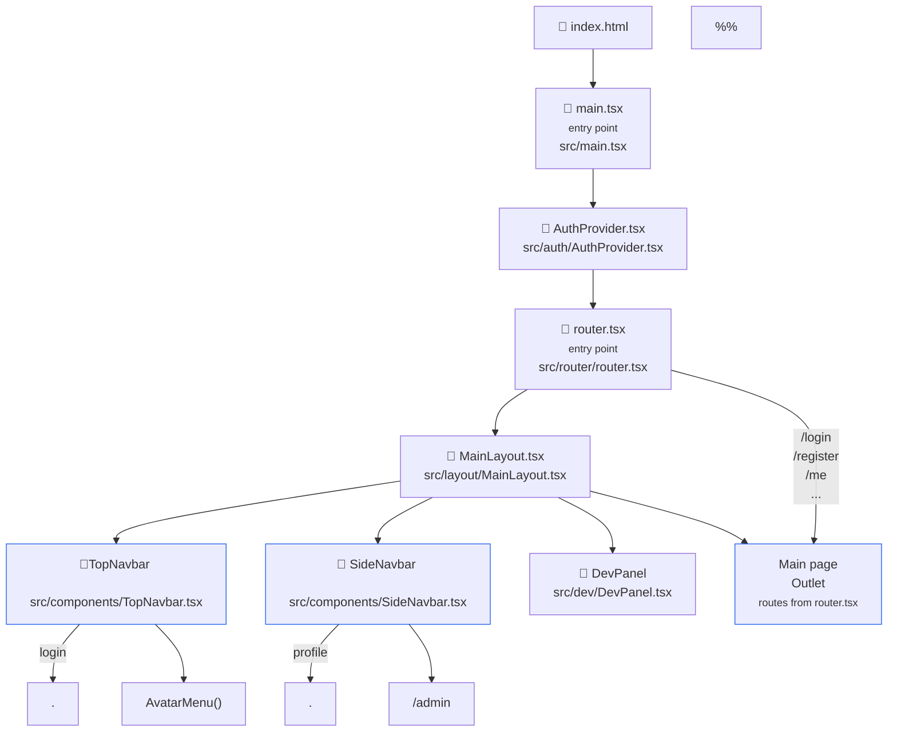
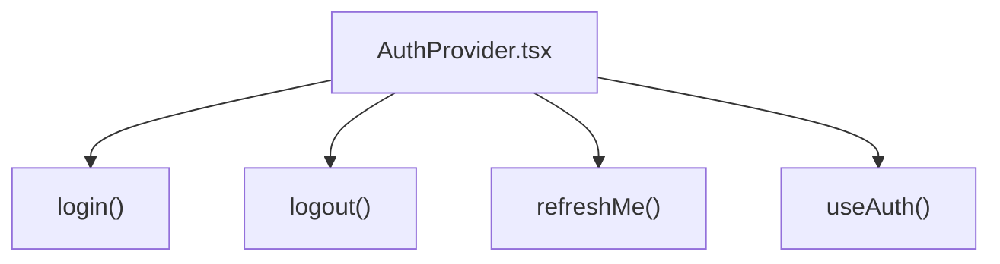

# Frontend Architecture flow

## Convention

| Type                           | Convention              |
| ------------------------------ | ----------------------- |
| Component React                | PascalCase              |
| Hook                           | camelCase with `use`    |
| Function                       | camelCase               |
| Utility Files                  | camelCase               |
| Entry Point of the application | low case (Ex: main.tsx) |

## Main Flow

See that **AuthProvider.tsx** is the central authentication component !

## Authentication Flow

AuthProvider is the central authentication component.

It exposes:

- login()
- logout()
- refreshMe()
- useAuth()
-

