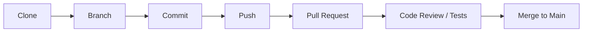
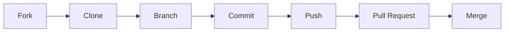

# 🤝 How to Contribute to SkoreFlow

## 👥 Mode Collaboration (Direct Access)

If you are a member of the core team.

### 1. Clone the repository

```bash
git clone https://github.com/ckl67/SkoreFlow.git
cd SkoreFlow
```

### 2. Create a branch

```bash
git checkout -b <github-login>/dev
git checkout -b <github-login>/My New feature
```

### 3. Workflow



## Mode Fork

If you want to propose a change without direct write access.

### 🍴 1. Fork the repository

```bash
git clone https://github.com/ckl67/SkoreFlow.git
cd SkoreFlow
```

Add upstream:

```bash
git remote add upstream https://github.com/ckl67/SkoreFlow.git
git remote -v
```

### 🌿 2. Create a branch

```bash
git checkout -b <github-login>/My New feature or My correction
```

Examples:

```bash
git checkout -b paul/fix login-error
```

### 🔄 3. Workflow



### 💻 4. Development

```bash

git status
git add .
git commit -m "feat: add PDF export"
```

### 🔁 5. Sync with upstream

```bash
# Update your local main
git fetch upstream
git checkout main
git merge upstream/main

# Rebase your feature branch
git checkout <your-branch>
git rebase main
```

### 🚀 6. Push

```bash
git push origin <your-branch>
# Then open a PR on GitHub
```

### 🔀 7. Pull Request

- Open PR on GitHub
- Explain what, why, how

### 🧪 8. Testing

See directory : /testauto

```bash
./auto-test.sh
```

All tests must pass.

## ✅ Checklist

- [ ] Builds
- [ ] Tests pass (./auto-test.sh is green).
- [ ] Up to date
- [ ] Clean commits
- [ ] PR documented
