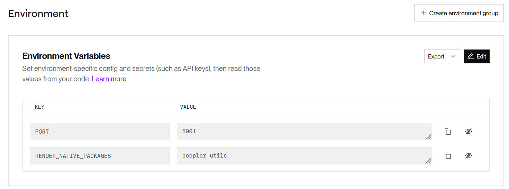
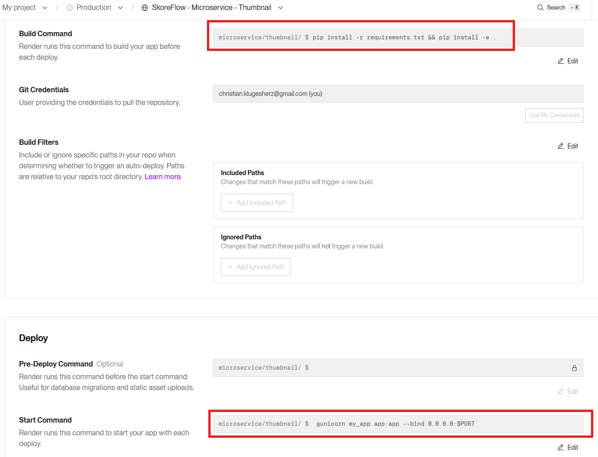

# thumbnail-service

[← back](../../doc.md)

## Sandbox

On render.com

## Service

For thumbnail: Select "Web Services" on the PaaS

```text
Web Services — Dynamic web app. Ideal for full-stack apps, API servers, and mobile backends.
```

## Prerequisite pdftoppm

We have seen that pdftoppm is a prerequisite for microservice.
pdftoppm is the tool that pdf2image calls in the background to convert PDF pages into PNG/JPEG images.
pdftoppm is normally installed on Linux, and the PaaS - Render server - (unprivileged container): To prevent malicious code from damaging their servers, they do not allow to use `sudo` or modify the operating system.

Add Poppler directly to Render

- Go to your Render dashboard, under your Web Service.
- Click on the Environment tab.
- In the Environment Variables section (not Secret Files, but the standard variables), click Add Environment Variable.
  - Add this special variable that Render uses to install Linux packages:
    - Key: RENDER_NATIVE_PACKAGES
      - Value: poppler-utils
  - Add PORT value:5001
- Click Save Changes.



### Settings

- Root Directory
  - microservice/thumbnail
- Build Command
  - pip install -r requirements.txt && pip install -e .
- Start Command
  - gunicorn my_app.app:app --bind 0.0.0.0:$PORT

 

### Environment Variables

- Key: RENDER_NATIVE_PACKAGES
  - Value: poppler-utils
- key PORT
  - 5001

### Test the service

Test that service is running

```shell
  https://thumbnail-tgzi.onrender.com
```
